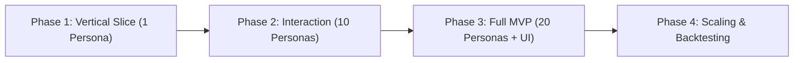

# Project Plan: Maharashtra Policy Simulator

## 1. Project Overview & Objective

* **Goal:** Build an AI-enhanced agent-based policy simulator to model the uptake, bottlenecks, and behavioral outcomes of Maharashtra government education schemes using synthetic citizen personas.
* **Initial Target Policy:** **Rajarshi Chhatrapati Shahu Maharaj Shikshan Shulk Shishyavrutti Yojna** (Higher & Technical Education EBC scholarship).
* **Target Audience:** College-going students across Maharashtra.
* **Cost Target:** ₹0 infrastructure cost using local/open-source LLMs or free-tier APIs.

---

## 2. Core Architectural Principles

1. **Hybrid Architecture:**
   * **Python Core:** Rule engine (eligibility criteria, income caps, fee relief percentages), probabilistic state transitions, metrics calculation, and aggregate analytics.
   * **AI / LLM Layer:** Persona reasoning, situational decision-making under uncertainty, conversational interaction, and contextual barrier explanations.
   * **Rule Integrity:** LLMs do not fabricate ground-truth probabilities; Python code computes mathematical baselines while LLMs supply reasoning and contextual adjustments.
2. **Simulation Step Cycle:**
   $$\text{Observe} \longrightarrow \text{Reason} \longrightarrow \text{Interact} \longrightarrow \text{Act} \longrightarrow \text{Update State}$$
3. **Outcome Dimensions:**
   * Eligibility
   * Awareness
   * Perceived Benefit
   * Application Probability
   * Completion Probability
   * Benefit / Uptake
   * Identified Barriers & Explanations

---

## 3. Implementation Phases & Milestones

### Phase 1: Foundation & Vertical Slice (1 Persona)
* **Objective:** Validate the complete hybrid loop with a single synthetic student persona before scaling.
* **Key Tasks:**
  * Define schema for the Rajarshi Chhatrapati Shahu Maharaj scholarship rules (eligibility, benefits, documents required).
  * Build deterministic eligibility and baseline probability calculators in Python.
  * Define single persona data structure (demographics, income, district, academic details, digital literacy, personality).
  * Implement LLM agent wrapper for persona reasoning (Observe $\to$ Reason $\to$ Act $\to$ Update).
  * Run end-to-end CLI execution producing individual outcome logs and explanations.

### Phase 2: Multi-Persona Cohort & Peer Interaction (10 Personas)
* **Objective:** Introduce demographic diversity and social interaction dynamics.
* **Key Tasks:**
  * Generate a representative cohort of 10 student personas across diverse Maharashtra regions (rural/urban, varied family income, caste categories, academic streams).
  * Implement peer interaction mechanics (word-of-mouth awareness, information sharing, peer nudges).
  * Implement state transition updates across multi-step simulation rounds.
  * Build cohort-level metric aggregation (awareness rate, application initiation rate, completion rate).

### Phase 3: Full MVP Delivery (20 Personas, API & Dashboard)
* **Objective:** Expand to the full 20-persona evaluation suite, expose via FastAPI, and provide an interactive frontend.
* **Key Tasks:**
  * Scale synthetic cohort to ~20 personas with full edge-case coverage (varying documentation readiness, digital access, parental awareness).
  * Implement SQLite + SQLAlchemy persistence for simulation runs, persona histories, and aggregated results.
  * Develop FastAPI backend exposing endpoints for scenario configuration, simulation execution, and results retrieval.
  * Build React + Vite dashboard displaying:
    * Policy parameter controls (income caps, subsidy percentages, application deadlines).
    * Individual persona inspection view (reasoning logs, barriers, decisions).
    * Cohort analytics and outcome charts (drop-off funnel, demographic disparities).
    * Assumptions, limitations, and data transparency disclosures.

### Phase 4: Post-MVP Scaling & Validation (Future)
* **Objective:** Scale population size and introduce statistical benchmarking.
* **Key Tasks:**
  * Expand agent cohort from 20 to 100+ personas.
  * Integrate machine learning models for predictive adjustments if verified historical data is available.
  * Backtest simulation outcomes against historical government scheme uptake reports.

---

## 4. Key Deliverables Summary

| Milestone | Deliverable | Scope |
| :--- | :--- | :--- |
| **M1: Vertical Slice** | `simulation/` engine CLI | 1 Persona, deterministic rules + LLM reasoning, full cycle |
| **M2: Social Cohort** | Multi-agent interaction module | 10 Personas, peer diffusion, multi-step simulation |
| **M3: MVP Backend & Data** | FastAPI service & SQLite models | 20 Personas, persistence, REST API for simulation runs |
| **M4: MVP Dashboard** | React + Vite UI | Interactive dashboard, scenario controls, persona viewer, charts |
